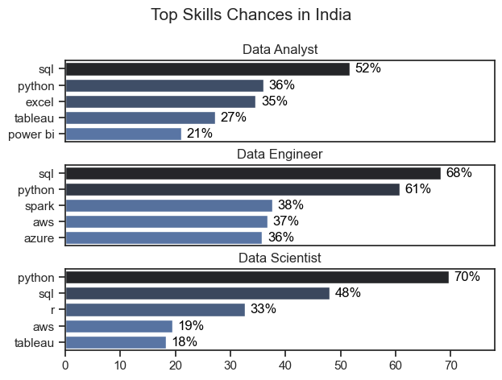
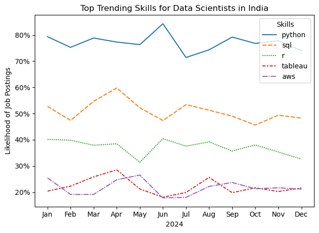
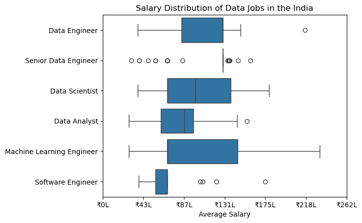
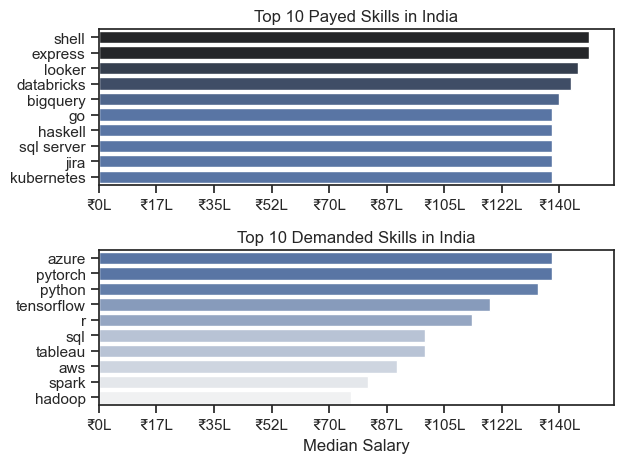

# The Analysis
## 1. What are the most demanded skills for data roles ? 
To understand the key skills required for data roles we undergo filtered out results  that showcase top 5 skills for each of the top 3 analytical roles.

Steps: [2_Skill_Demand.ipynb](project_python\2_Skill_Demand.ipynb)

### Results: 

### Insights:
Python and SQL seem to be the most basic skill requirement in the field of Data Science, most prominently for Data Scientists, Data Engineers and Data Analysts. Other relevant skills are to be specialised on the basis of requirement.
# 
## 2. How are the skills trending for Data scientists ?

We present this data through a line chart, which inturn are quite convenient.

Steps: [3_Skill_Trends.ipynb](project_python\3_Skill_Trends.ipynb)
### Results:

### Insights:
Python maintains its consistency as an absolute requirement for a Data Scientists, also playing the role of a starting point for aspirants.
# 
## 3.Financial Aspect for Top Data Roles and corresponding Top Skills

Steps: [4_Salary_Analysis.ipynb](project_python\4_Salary_Analysis.ipynb)

### Results:

### Insights:
Data Scientists can be considered to be the job role that is most stable compared to others, with respect to the skills one brings to the table(azure,pytorch or even shell,express
 ).

